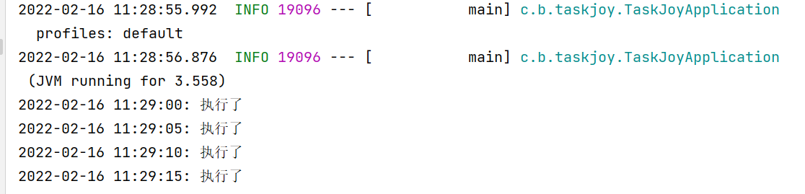

# task-joy
task-joy是仿写Spring的Task模块，简化Spring一些复杂步骤，使用注解@EnableScheduling2和@Scheduled2来定时任务。


##### 效果
编写启动类型，使用`@EnableScheduling2` 注解
```java
@SpringBootApplication
@EnableScheduling2
public class TaskJoyApplication {

    public static void main(String[] args) {
        SpringApplication.run(TaskJoyApplication.class, args);
    }

}
```

使用`@Scheduled2`注解创建一个任务
```java
@Component
public class MyTask {

    @Scheduled2(value = "task1", cron = "*/5 * * * * ?")
    public void task() {
        System.out.println("执行了");
    }
}
```

##### 运行

 
